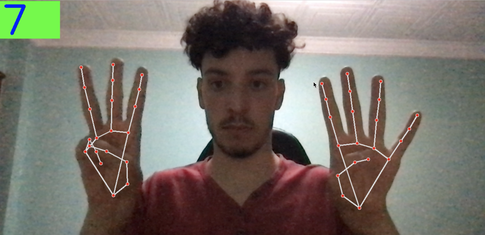

# Hand-Detection-Projects
This repository has different projects related to computer vision. Specifically, hand detection that is done by hand ML solution of [mediapipe](https://mediapipe.dev/).
### 1- hand_detection:
This code will simply detect the hand and draw its connection as shown

### 2- fingers_counter:
This code will detect the hands and counts how many fingers are held up. The number of the fingers is displayed on the image.

### 3- drag_drop:
This code draws multiple squares over the image and lets the user moves them in the frame using his hands. The way it works is the index finger has to be inside the
square to select it. to drag the square the user has to put his middle finger together with the index finger and move around (the center of the square will be
the tip of the index finger). To drop the square simply take the middle and index fingers apart.
This idea was inspired by [Murtaza's workshop](https://www.youtube.com/channel/UCYUjYU5FveRAscQ8V21w81A)
